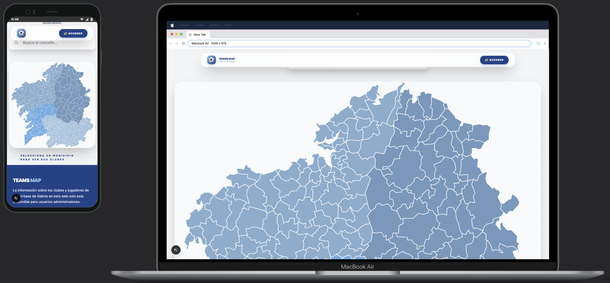

# Teams Map - Fútbol Base Galicia ⚽

**Teams Map** es una plataforma interactiva y profesional diseñada para la gestión, visualización y scouting de clubes y jugadores de fútbol base en Galicia. El proyecto combina una interfaz visual moderna con una infraestructura robusta basada en Supabase.



## 🚀 Características Principales

- **🗺️ Mapa Interactivo de Galicia**: Navegación visual a través de un mapa SVG detallado que permite explorar los 313 municipios (concellos) de la comunidad.
- **🛡️ Panel de Administración Seguro**: Gestión completa de datos (CRUD) para administradores autorizados mediante autenticación con Google.
- **🏃‍♂️ Gestión de Plantillas**: Registro detallado de jugadores incluyendo fotos, valoraciones técnicas, posiciones y pierna hábil.
- **🔍 Filtros Avanzados**: Buscador inteligente y filtros multicriterio para localizar perfiles específicos de jugadores y clubes.
- **📱 Diseño Responsive & Premium**: Interfaz optimizada para móviles, tablets y escritorio.
- **♿ Accesibilidad (WCAG)**: Estructura semántica de encabezados, alto contraste y navegación optimizada para lectores de pantalla.

## 🛠️ Stack Tecnológico

- **Frontend**: [Next.js](https://nextjs.org/) (App Router), [React](https://reactjs.org/), [Tailwind CSS](https://tailwindcss.com/).
- **Backend & DB**: [Supabase](https://supabase.com/) (PostgreSQL, Storage, Auth).
- **Autenticación**: [NextAuth.js](https://next-auth.js.org/) con Google Provider.
- **Lenguaje**: [TypeScript](https://www.typescriptlang.org/) (100% Type-Safe).
- **Despliegue**: [Vercel](https://vercel.com/).

## 📂 Estructura del Proyecto

El proyecto sigue una arquitectura modular y escalable:

```text
src/
├── app/             # Rutas y páginas (Next.js App Router)
├── components/      # Componentes organizados por responsabilidad
│   ├── ui/          # Elementos básicos y botones (Design System)
│   ├── forms/       # Formularios de lógica compleja
│   ├── layout/      # Estructura global (Navbar, Footer)
│   └── features/    # Funcionalidades núcleo (Mapa, Filtros)
├── lib/             # Lógica compartida, acciones y constantes
├── types/           # Definiciones globales de TypeScript
└── data/            # Datos estáticos (GeoJSON de municipios)
```

## ⚙️ Configuración y Ejecución

1. **Clonar el repositorio**:

   ```bash
   git clone https://github.com/Aaron-GF/teams-map.git
   cd teams-map
   ```

2. **Instalar dependencias**:

   ```bash
   pnpm install
   ```

3. **Variables de Entorno**:
   Crea un archivo `.env.local` con las siguientes claves:

   ```env
   NEXTAUTH_URL=http://localhost:3000
   NEXTAUTH_SECRET=tu_secreto
   GOOGLE_CLIENT_ID=...
   GOOGLE_CLIENT_SECRET=...
   ALLOWED_EMAILS=email1@gmail.com,email2@gmail.com
   NEXT_PUBLIC_SUPABASE_URL=...
   NEXT_PUBLIC_SUPABASE_ANON_KEY=...
   ```

4. **Ejecutar en desarrollo**:
   ```bash
   pnpm dev
   ```

## 📄 Licencia

Este proyecto está bajo la licencia **CC BY-NC-SA 4.0** (Attribution-NonCommercial-ShareAlike 4.0 International).

---

Desarrollado con ❤️ por [Aaron-GF](https://github.com/Aaron-GF).
